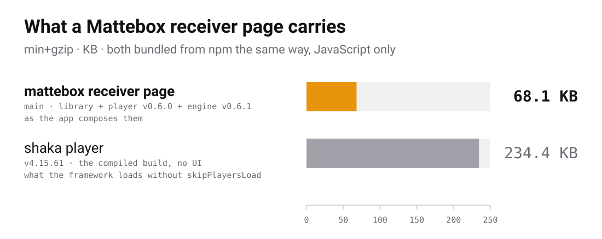

<h1>
  
  Mattebox Cast receiver
</h1>

[](https://github.com/jboix/mattebox-receiver/actions/workflows/quality.yml)
[](https://www.npmjs.com/package/@mattebox/cast-receiver)
[](https://www.npmjs.com/package/@mattebox/cast-playground)
[](./LICENSE)

The Mattebox Cast receiver lets you build a Chromecast receiver page that
plays with [`<mattebox-player>`](https://github.com/jboix/mattebox-player)
and the [mattebox](https://github.com/jboix/mattebox) engine. It connects
Google's receiver framework to the player, so the sender's commands control
the player. This repository contains two packages and a demo app.

| Package                     | What it is                                                                                        | Side effects       |
| --------------------------- | ------------------------------------------------------------------------------------------------- | ------------------ |
| `@mattebox/cast-receiver`   | The library. It connects Google's receiver framework to the player. It creates no DOM.            | none               |
| `@mattebox/cast-playground` | A CLI. It runs a receiver page in a desktop browser, with sender controls, so you need no device. | none, run by `npx` |

A receiver is a web page. You host it, you register its URL in the Cast
developer console, and the Chromecast loads it. You build that page with
the library. The app in [`app/`](app) is an example of such a page.

The library has three peer dependencies: the engine, the player and the
player's core. The playground is optional.

<picture>
  <source media="(prefers-color-scheme: dark)" srcset="docs/size-chart-dark.svg">
  
</picture>

By default, Google's framework downloads Shaka Player to play the media.
The library disables that download, because the Mattebox player plays the
media instead. The chart compares the two sizes, min+gzip, JavaScript only.

## Quick start

Install the library and its peers:

```sh
npm install @mattebox/cast-receiver @mattebox/player @mattebox/player-core mattebox --save
```

Add Google's framework to the page. Google requires that you load it from
gstatic:

```html
<script src="https://www.gstatic.com/cast/sdk/libs/caf_receiver/v3/cast_receiver_framework.js"></script>
```

Create the receiver, create the player with the receiver's handlers, and
start the receiver:

```ts
import { createReceiver } from "@mattebox/cast-receiver";
import { MatteboxPlayerElement } from "@mattebox/player";
import full from "mattebox/presets/full";

const receiver = createReceiver({ preset: full });
const player = new MatteboxPlayerElement({ handlers: receiver.handlers() });
document.body.append(player);
receiver.start(player);
```

The library creates no elements, so you control how the page looks. You
style the player with its controls, `::part()` and its `--mbx-*` tokens.

You can change what the player loads with the `resolve` option. By default,
the library plays the URL the sender sent and reads the DRM license URL from
`customData.mattebox`.

You can test a receiver page without a Chromecast by using the playground.
It opens the page in a desktop browser, next to the controls of a sender:

```sh
npx @mattebox/cast-playground http://localhost:5173/
```

The [guide](docs/guide/README.md) covers the rest, starting with
[Getting started](docs/guide/01-getting-started.md).

## Documentation

- [Guide](docs/guide/README.md): the page, loads, deployment and registration.
- [Architecture](docs/architecture.md): the parts of the repository and how the status reaches the sender.
- [App documentation](app/README.md): how to run the demo app, its files and its query parameters.
- [Playground](packages/cast-playground/README.md): how to use the playground and its options.
- [Demo](https://jboix.github.io/mattebox-receiver/): the demo app, deployed.

## Contributing

See the [contributing guide](docs/CONTRIBUTING.md). Participation is governed
by the [Code of Conduct](docs/CODE_OF_CONDUCT.md). Vulnerabilities go through
[SECURITY.md](docs/SECURITY.md).

## License

MIT, see [LICENSE](LICENSE).
